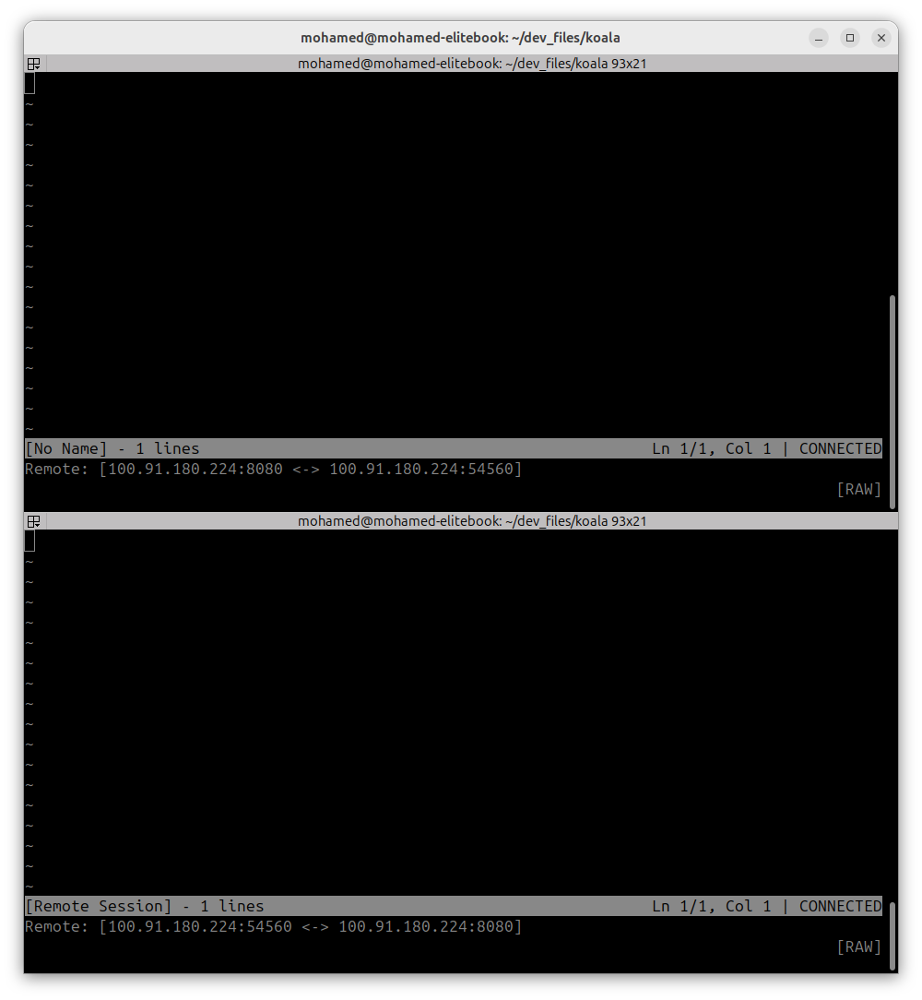

# Koala is a minimal terminal collaborative text editing

## Overview

Koala is a vim-inspired terminal text editor enabling multiple users to edit documents simultaneously. Built from scratch using low-level terminal control.

## Features

### Current Implementation

- Modal editing - RAW, INSERT, and PROMPT modes
- Vim-like navigation - WASD movement keys
- Basic text operations - Character insertion, newline handling, backspace
- Raw terminal control - Direct terminal manipulation without ncurses
- Minimal footprint - Lightweight C implementation with no heavy dependencies

### Planned Features

- Real-time collaborative editing - Multiple users editing the same document simultaneously
- Conflict resolution - Operational Transform (OT)
- Network protocol - WebSocket or TCP-based communication layer
- User awareness - See cursor positions and edits from other participants
- Persistence - Save and load files

## project folders structure

```bash
KOALA/
├── src/
│   ├── editor.c/h
│   ├── ot.c/h
│   ├── network.c/h
│   └── main.c
├── test/
├── build/
└── Makefile (full version)
```

## Screenshots



___
**Note:** Koala is a side project for exploring low-level Linux systems programming, socket networking, and distributed systems concepts.

It isn't meant to be a functional aplication for daily usage.
